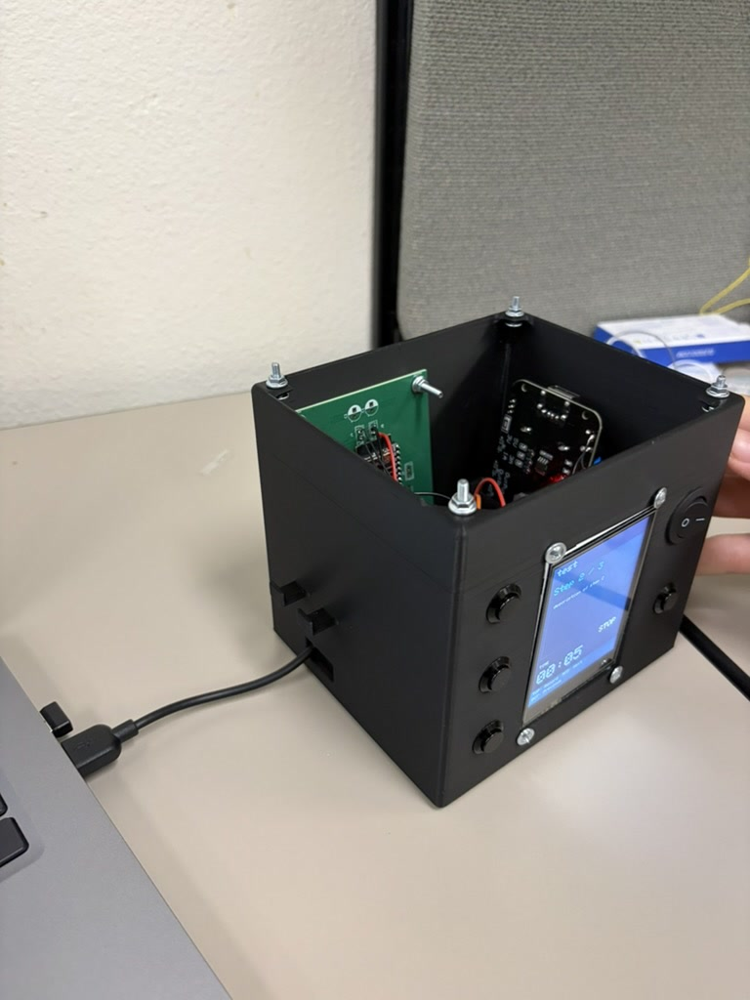
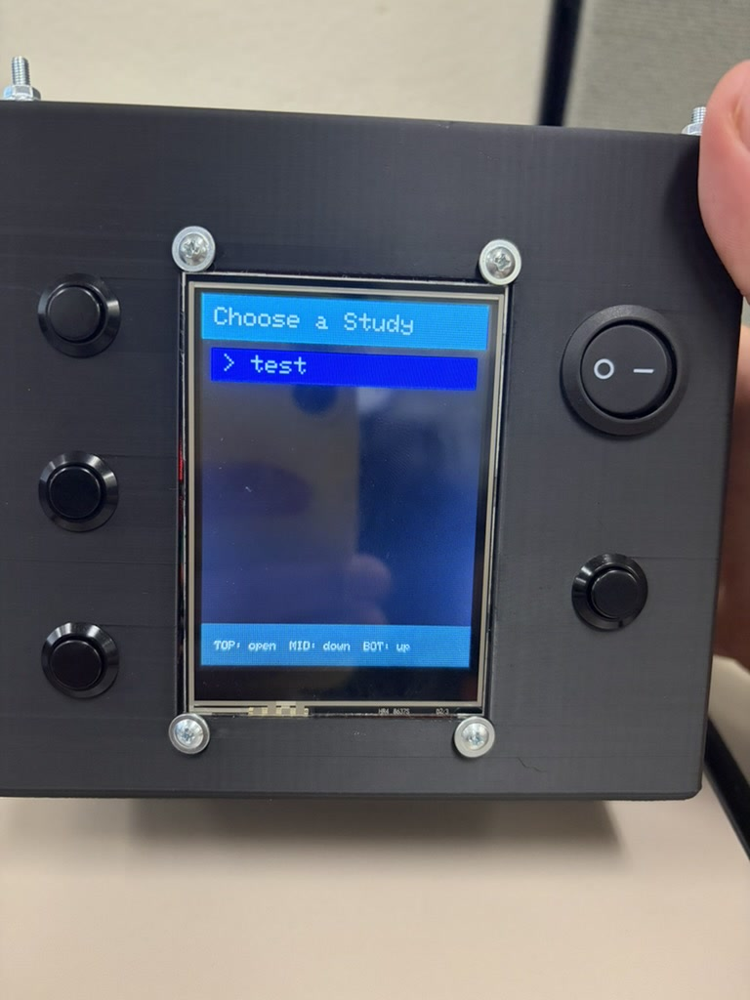
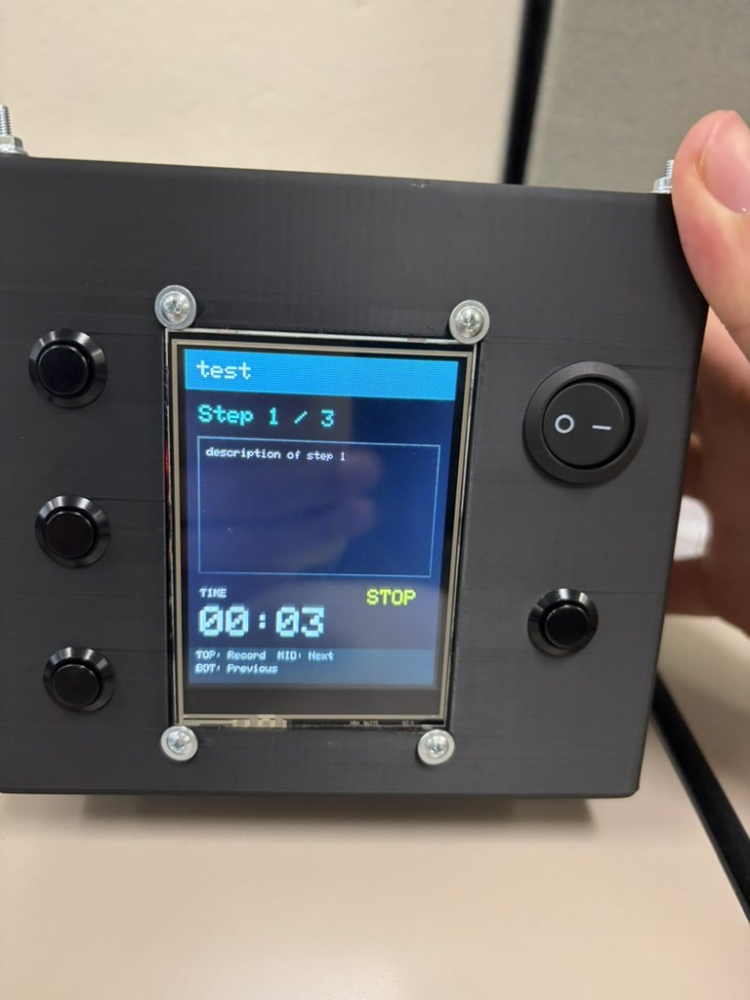
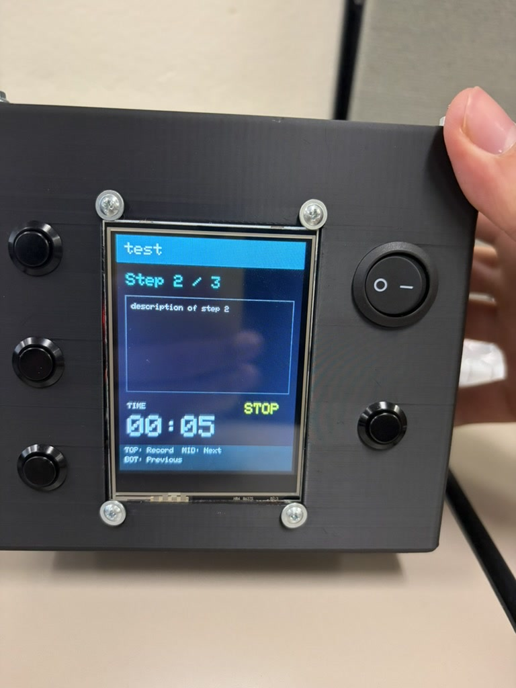
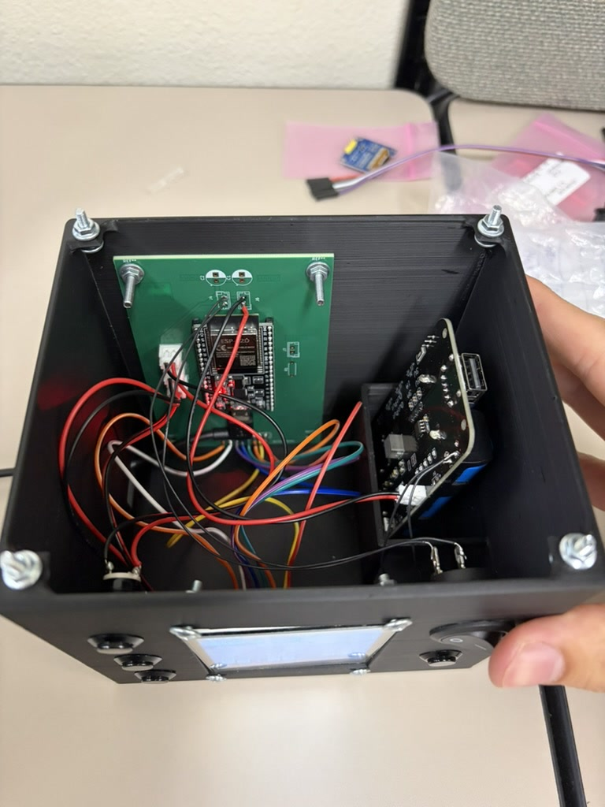
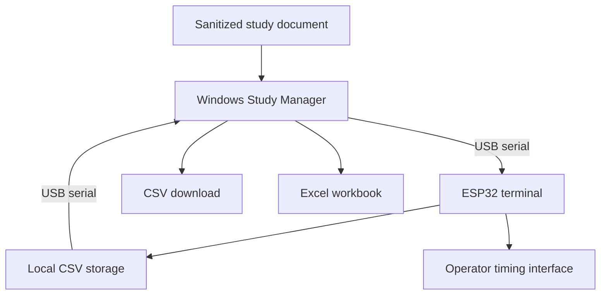
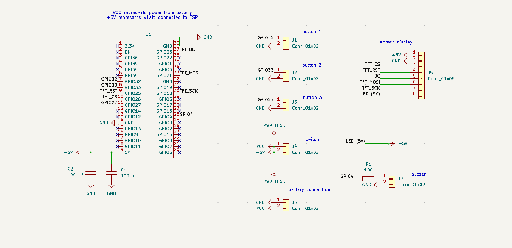
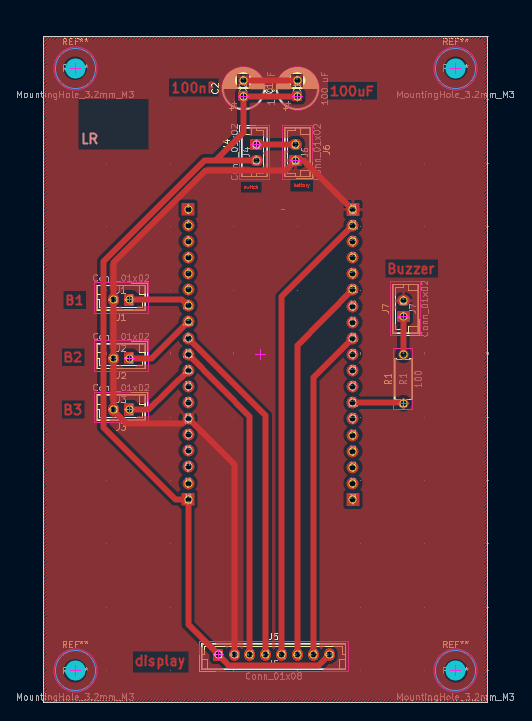
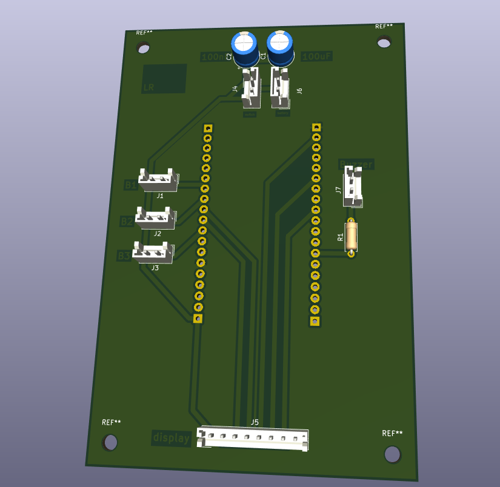

# Portable ESP32 Time-Study System

An end-to-end engineering project that turns production instructions into portable, operator-controlled time studies. The system combines a battery-powered ESP32 terminal, custom electronics and enclosure design, embedded firmware, and a Windows desktop application for creating, recording, reviewing, and exporting study data.

## Demo

[▶ Watch the ESP32 Time-Study System demo video](Pictures/esp32_time_study_demo.mp4)

The demo shows the completed handheld prototype running the on-device study workflow, including study selection, step navigation, and operator-controlled timing.

## Final prototype

The completed system packages the ESP32, display, physical controls, battery hardware, and interface electronics into a portable 3D-printed enclosure.



### On-device study selection

Stored studies can be selected directly from the handheld device before beginning a timing session.



### Step timing workflow

The display presents the current operation while the physical controls allow the operator to record time and move between steps.





### Internal electronics

The enclosure integrates the ESP32 development board, battery system, wiring, display interface, switches, and supporting electronics into a self-contained unit.



## Engineering outcome

This project replaced a centralized, manually coordinated timing process with a portable workflow that can be used directly at the workstation. A single system now supports the full path from study creation to recorded results:

1. A user selects a sanitized Job Traveler or prepared study document.
2. The desktop application converts its operations into editable study steps.
3. The study is transferred to the ESP32 over USB.
4. An operator records elapsed time for each step from the handheld terminal.
5. Completed studies can be reviewed, downloaded as CSV files, or exported to Excel.

The result is a practical engineering tool that integrates mechanical design, electronics, embedded programming, desktop software, serial communication, and structured data export into one deployable system.

## Key accomplishments

- Designed and built a portable ESP32 operator terminal for decentralized time collection.
- Developed a custom 3D-printed enclosure in SolidWorks around the display, controls, battery system, and internal electronics.
- Created a three-button interface that allows operators to select studies, move between steps, and start or stop timing without a keyboard.
- Implemented local CSV storage so studies remain available directly on the ESP32.
- Defined a lightweight serial command protocol between the Windows application and the embedded device.
- Built a desktop application for study creation, file management, CSV preview, deletion, and Excel export.
- Added editable step previews so users can correct, reorder, remove, or add operations before transferring a study.
- Produced repeatable build configuration and end-user documentation for deployment and support.
- Developed the system for use across multiple manufacturing departments, demonstrating that the design could scale beyond a single workstation.

## System architecture



## Hardware

- ESP32-D DevKit development board
- 3.2-inch screen display
- Three momentary pushbuttons
- On/off power switch
- diymore dual-18650 battery holder and charging board
- 2.5 mm JST-EH connectors
- Custom interface PCB
- Custom SolidWorks enclosure and 3D-printed housing
- Wiring, fasteners, and supporting electronic components

The schematic includes provisions for decoupling capacitors and a buzzer. Those components were not installed on the final prototype after evaluation of the implemented design requirements.

## Engineering design visuals

### System schematic

The schematic documents the ESP32 connections, operator buttons, display interface, power input, switch, and optional buzzer circuit.



### PCB layout

The custom PCB layout organizes the ESP32 headers, display and control connections, power components, and enclosure mounting points.



### PCB 3D view

The 3D board view was used to review component placement and mechanical integration before assembly.



## Software

### ESP32 firmware

The firmware provides the on-device workflow and file-management layer. It:

- Displays stored studies and step information.
- Uses physical buttons for menu navigation and timing control.
- Accumulates elapsed time for each operation.
- Stores study definitions and results as CSV files.
- Responds to commands from the desktop application over a 115200-baud serial connection.

### Windows Study Manager

The desktop application is written in Python and uses a local HTML/CSS/JavaScript interface through `pywebview`. It provides four main workflows:

- **Home:** Detects the connected ESP32 and displays device status.
- **Create Study:** Parses a study document, previews its steps, and uploads the final study to the device.
- **Current Studies:** Lists stored CSV files and previews recorded results.
- **Export:** Combines selected studies into an Excel workbook with one worksheet per study.

## Data and serial workflow

The desktop application communicates with the ESP32 using simple text commands. The protocol supports:

- Creating a new study
- Adding numbered study steps
- Listing stored CSV files
- Retrieving a selected CSV file
- Deleting a study

Study results use a straightforward CSV structure:

```text
Step Number,Step Description,Time (mm:ss)
1,Example operation,00:00
2,Example operation,00:00
```

This format keeps the device implementation lightweight while making the results easy to inspect, archive, and analyze.

## Repository structure

```text
.
├── app.py                         # Desktop application and serial interface
├── jt_parser.py                   # Study-document step parser
├── esp32_reader.py                # Standalone ESP32 communication utility
├── flashMe/
│   └── flashMe.ino                # ESP32 firmware
├── web/
│   └── index.html                 # Desktop application interface
├── ESP32 Study Manager.spec       # PyInstaller build configuration
├── build.bat                      # Windows build helper
├── requirements.txt               # Python dependencies
├── Pictures/                      # Sanitized project images and demo video
├── Hardware Info.docx             # Hardware operation reference
├── Project Materials.docx         # Project bill of materials
└── User Guide - Sensitive Info. Removed.docx
                                     # Sanitized software user guide
```

## Installation

### Requirements

- Windows computer
- Python 3.10 or newer
- USB data cable
- Programmed ESP32 terminal
- CP210x or CH340 USB-to-serial driver when required by the connected board

### Set up the desktop application

```bash
git clone https://github.com/LRagogna/Dytran-Internship----ESP32-Project.git
cd Dytran-Internship----ESP32-Project
python -m venv .venv
.venv\Scripts\activate
pip install -r requirements.txt
python app.py
```

### Build the Windows executable

Install PyInstaller if it is not already available, then run:

```bat
build.bat
```

The included `.spec` file packages the Python application and web interface into the Windows build.

## Typical use

1. Connect the ESP32 terminal to the computer with a USB data cable.
2. Start the ESP32 Study Manager.
3. Confirm that the device appears as connected.
4. Open **Create Study** and select a sanitized input document.
5. Review and edit the parsed operations.
6. Enter non-sensitive study identifiers and transfer the study to the ESP32.
7. Disconnect the portable terminal and record each operation at the workstation.
8. Reconnect the terminal to review, download, or export the completed study.

## Engineering disciplines demonstrated

- Embedded C/C++ development
- Python desktop application development
- HTML, CSS, and JavaScript user-interface design
- USB serial communication and protocol design
- PCB schematic capture and layout
- Power-system and battery integration
- SolidWorks enclosure design
- 3D printing and mechanical assembly
- CSV and Excel data processing
- System integration, troubleshooting, and technical documentation

## Privacy and publication notice

Only sanitized demonstration data should be committed to this public repository. Do not upload:

- Actual Job Travelers or manufacturing instructions
- Company part, drawing, fixture, or work-order numbers
- Customer information
- Production measurements or proprietary process parameters
- Credentials, tokens, serial numbers, or internal network information
- Photographs containing GPS or other sensitive metadata

Strip image metadata before committing photographs, and review the full Git history if sensitive material was ever committed and later deleted.

## Project status

The project reached a functional integrated-prototype stage: the hardware terminal, embedded firmware, desktop interface, serial transfer, local timing workflow, CSV storage, and Excel export were brought together into a complete working system.

## Author

Leonardo Ragogna
